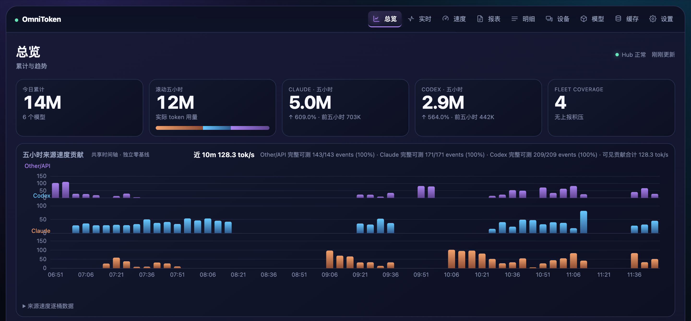
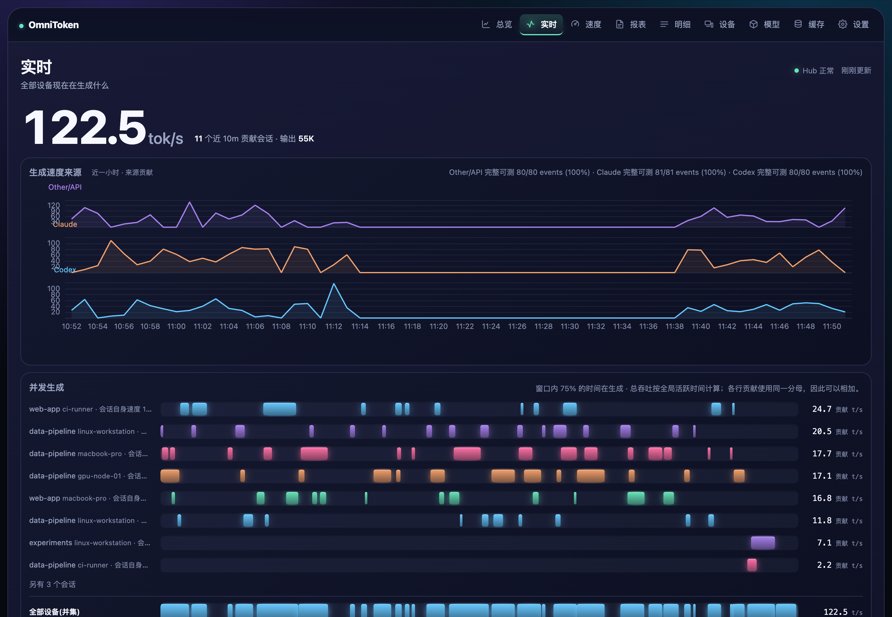
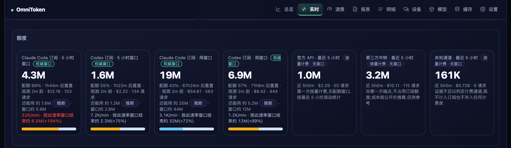
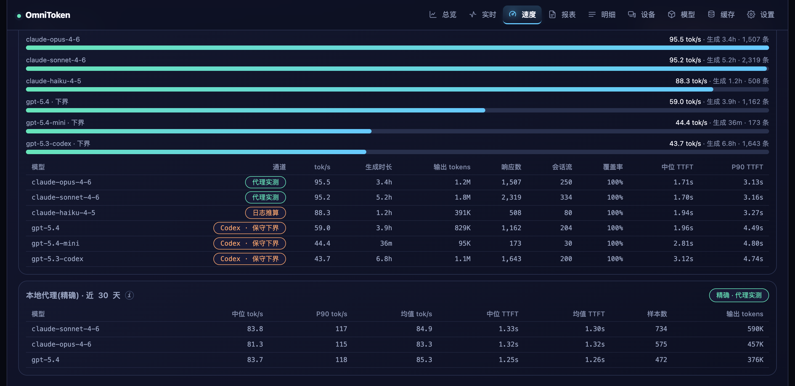
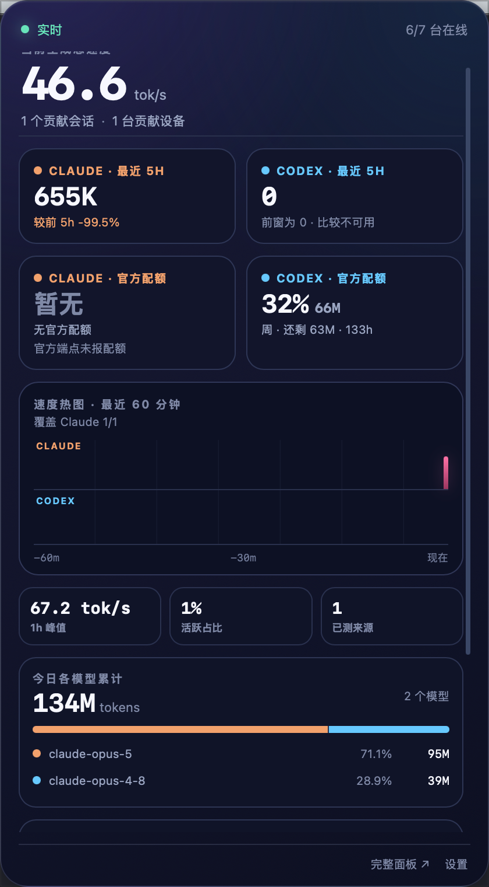

<div align="center">

# OmniToken

**Self-hosted, cross-device token accounting for Claude Code and Codex.**

One Go binary. One SQLite file. Your data never leaves your machines.

[](https://github.com/SuooL/OmniToken/actions/workflows/ci.yml)
[](https://github.com/SuooL/OmniToken/releases)
[](LICENSE)
[](go.mod)

[中文文档](README.zh-CN.md) · [Docs](docs/README.md) · [Architecture](docs/architecture.md) · [ADRs](docs/adr/README.md)

</div>

---

You run Claude Code on your laptop, Codex on a dev box, and an agent loop on a GPU node.
Every one of those machines keeps its own usage log, and none of them talks to the others.
So the questions that actually matter have no answer:

- How much did I *actually* spend this week — across all four machines?
- How much of my 5-hour window is left, right now, before I start a long refactor?
- Which repo is burning the budget? Which model? Which machine?

`ccusage` answers those for **one** machine, after the fact. OmniToken answers them for
**your whole fleet, live** — and keeps every event in a SQLite file you own.

## Why OmniToken

### 🔒 Your data stays yours

No SaaS, no telemetry, no account. **Conversation content is never read** — the parsers
deserialize only usage counters and metadata, and the request body is discarded at the
deserialization layer. API keys, when the optional proxy is used, are stored as a truncated
SHA-256 fingerprint, never in plaintext. Device credentials are stored as SHA-256 hashes
and compared in constant time.

### 🌐 Cross-device, at event granularity

Not summaries — **every request**, from every machine, in one database, deduplicated by a
global `event_id`. That means you can still drill from "this week cost $X" all the way down
to the individual request that caused it, six months later. Machines report outbound-only
over HTTPS; no public IP, no inbound ports, no VPN required (though a VPN is the
recommended topology).

### 📊 Authoritative quota, not guesswork

The 5-hour and weekly subscription windows come from the vendor's own `rate_limits`
payload — not from a heuristic that re-implements the window logic and drifts. Inferred
numbers exist too (burn-rate projection, remaining-capacity estimate), and they are
**always labeled as inferred**. The two are never mixed into one number.

### 📦 One binary, no runtime

Pure Go, no CGO, **two direct dependencies**. The web dashboard is embedded in the binary
via `go:embed`; there is no Node, no bundler, no build step, no container. Drop a 13 MB
file on a headless server and run it.

## Screenshots

<div align="center">



<em><b>Overview</b> — today / rolling-5h totals with period-over-period deltas, and per-source
generation-speed lanes on a shared timeline with independent baselines.</em>

<br>



<em><b>Live</b> — aggregate throughput, per-source curves with coverage ratios, and one lane per
concurrent session plus a union row for the whole fleet. Pushed over SSE.</em>

<br>



<em><b>Quota</b> — one card per window, carrying the authoritative percentage and reset alongside the
burn-rate projection (red when it overshoots) and the remaining allowance, which is marked
<b>inferred</b> so it can never be mistaken for the measured number beside it. Pay-as-you-go channels
get no progress bar: they have no window to be a fraction of.</em>

<br>



<em><b>Speed</b> — tok/s and TTFT per model, with each measurement channel labeled separately:
proxy-exact, log-derived, and Codex conservative-lower-bound.</em>

</div>

> All screenshots use **synthetic demo data**. They illustrate the layout, not a benchmark.
> Note that the dashboard UI is currently **Chinese-only** — see [limitations](#limitations).

## Quick start

**One-line install** (Linux/macOS — downloads the binary, verifies it against `SHA256SUMS`,
enrolls the device, and installs a launchd/systemd/cron service):

```sh
curl -fsSL https://github.com/SuooL/OmniToken/releases/latest/download/install.sh \
  | OMNITOKEN_ADMIN_TOKEN='<ADMIN>' sh -s -- \
      --server https://hub.example.net --name "$(hostname)"
```

**Or run the hub yourself.** On any always-on machine:

```sh
# Download from Releases, or build it:
make build            # or: go build -o omnitoken ./cmd/omnitoken

./omnitoken serve     # collects this machine, imports history on first run
```

Open <http://127.0.0.1:8787>. That's it — a single machine needs no configuration at all.
The hub writes a fully-populated `~/.omnitoken/config.json` on first start so you can see
every default you might want to change.

**Add more machines.** On each one, enroll and run as a service:

```sh
OMNITOKEN_ADMIN_TOKEN=... ./omnitoken agent enroll -server <HUB_URL> -name <NAME>
./omnitoken agent
```

Windows has a one-liner too (`install.ps1`) — see the [deployment guide](docs/deployment.md).

## The dashboard

Nine pages, all served from the binary:

| Page | What's on it |
|---|---|
| **Overview** | Today / rolling-5h totals, Claude vs Codex split, fleet coverage, per-source speed lanes, top contributors, device usage, billing-channel mix, today's model composition, 365-day heatmap |
| **Live** | Current aggregate tok/s, concurrent generation lanes, per-device status, **open sessions read from the process table**, authoritative quota tiles + burn-rate projection — pushed over SSE |
| **Speed** | 60-minute throughput curve, per-model tok/s and TTFT (median/P90), coverage ratio per channel, exact proxy-measured numbers listed separately |
| **Reports** | Day / week / month / session aggregation over any range, CSV and JSON export |
| **Details** | Event-level drill-down: filter by device, source, model, repo; per-request cost; paginated |
| **Devices** | Per-device comparison, outbox backlog, connection state, daily stacked usage |
| **Models** | Model × source breakdown, cost-per-token scatter, daily composition |
| **Cache** | Hit rate, 1h/5m TTL structure, equivalent savings per model |
| **Settings** | Pricing overrides (hot-reloaded — history is recosted instantly), device rename, device identity merge with a preview-and-confirm flow |

Charts are rendered with a vendored ECharts build; the heatmap is hand-drawn SVG.

## Integrations

**Claude Code status line** — one command installs the hook, and it *wraps* an existing
status line rather than replacing it:

```sh
omnitoken statusline -setup      # -setup-undo to revert
```

```
Opus 4.8 15.0K $1.25 · 今日 5.4M $10.00(2 台) · 5h 97% 1h08m · 周 36% 70h00m
```

Session numbers come from Claude Code itself; **today's total is fleet-wide**; the quota is
the authoritative value. Render budget is ~300 ms with a 200 ms network timeout — if the
hub is unreachable it falls back to a ≤10 s cache and appends `⟳`. It never blocks your
prompt.

**macOS menu bar app** — a Tauri thin client showing a gauge icon, quota, live speed, and
alerts at 75% / 90%. It connects to a running hub; it does not collect anything itself.
Build it with `make desktop` (see [limitations](#limitations) — it is not yet shipped in
Releases).

<div align="center">

</div>

<div align="center"><em>Unlike the dashboard shots above, this one is a real fleet. Claude's quota
tile reads <em>no data</em> because nothing had refreshed that status line recently — the capture is
opportunistic by design, and the panel says so instead of showing a stale percentage.</em></div>

**Local API proxy** (optional, off by default) — point a script's `base_url` at
`http://127.0.0.1:8899/anthropic` and requests are forwarded **verbatim** while OmniToken
records usage, **exact TTFT**, and wall time. This is the only channel that can measure
first-token latency precisely, because the logs simply do not contain it.

## How it works

```
Claude Code / Codex logs        process table        optional API proxy
            │                        │                       │
            ▼                        ▼                       ▼
      internal/parser/*  ──►  internal/collect  ──►  Sink (injected)
                                                     ├── serve: write to SQLite
                                                     └── agent: durable outbox → HTTPS
                                                                      │
                                                                      ▼
                                            Hub: ingest (idempotent) → SQLite
                                                                      │
                                              query/aggregate API + embedded web + SSE
```

Two roles, one binary. `serve` is the single authority — one hub, one database. `agent`
scans logs and reports outbound-only. Both share the same collection layer; they differ
only by which sink is injected. A relay is a stateless reverse proxy, so `agent → relay →
hub` chains work without a second source of truth.

Four ways to connect a machine, freely mixable: **encrypted overlay** (Tailscale/WireGuard —
the default recommendation), **SSH tunnel**, **trusted LAN**, or **public HTTPS ingress**
behind a reverse proxy. There's also **SSH pull**, which mirrors logs from a remote host
that can't run an agent at all — zero install on the far end.

## Correctness is the product

A usage monitor that double-counts is worse than no monitor, because you'll trust the wrong
number. And unlike a rendering bug, a counting bug **poisons the database** — reverting the
code doesn't repair the history. So the invariants are written down, tested, and enforced:

- **Idempotent by `event_id`.** The same log line arriving via local scan, agent push, SSH
  pull, a rescan, or a post-outage retry is counted exactly once. Upstream components are
  free to redo work; the storage layer guarantees convergence.
- **A second key for the same generation.** Codex forks (subagents, manual branches) copy
  the parent thread wholesale into a new rollout with fresh timestamps — so the copies have
  *different* `event_id`s by construction. A `dedup_key` derived from `turn_id` + cumulative
  usage catches them. Measured on 610 rollouts: 845 of 33,445 events (2.53%) were copies,
  3.12% of output tokens double-counted. ([ADR-0020](docs/adr/0020-codex-resume-duplicate-events.md))
- **Offsets advance only after a successful report.** The log file *is* the retry buffer;
  advancing early would lose data during an outage.
- **Authoritative beats inferred, and inference is labeled.** Quota comes from the vendor's
  own payload. Projections and capacity estimates carry an explicit badge.
- **Overwriting an already-stored row is whitelist-only, and never touches a counting
  column.** "Which device gets credited" and "how many times it's counted" are different
  questions. Every exception has an ADR.
- **Timezone is a config value, not the host's mood.** The same data, aggregated in
  `America/New_York` vs `Asia/Shanghai`, differed by more than 2× for "today". An invalid
  timezone refuses to start rather than silently degrading. ([ADR-0021](docs/adr/0021-aggregation-timezone.md))
- **Auth is derived from the listen address, not a flag.** Loopback-only means zero config.
  Reachable from the network with no credentials configured means **the process refuses to
  boot**. The rule exists to defend against forgetting. ([ADR-0016](docs/adr/0016-read-endpoint-auth.md))

Several of these decisions overturned an earlier one after real data contradicted it. The
speed metric was wrong three different ways before ADR-0009; the Codex billing classifier's
first heuristic scored 20.8% precision and was thrown out. The [ADRs](docs/adr/README.md)
keep the corrections rather than hiding them.

## How it compares

Based on reading the source of both projects ([survey notes](docs/references.md)):

| | ccusage | token-monitor | OmniToken |
|---|---|---|---|
| Form factor | Node CLI | Electron desktop app | Single Go binary |
| Tool coverage | **15+ tools** | many | Claude Code + Codex only |
| Multi-device | ❌ | ✅ summary-level sync | ✅ **event-level, one database** |
| Live updates | ❌ one-shot report | ✅ | ✅ SSE |
| Headless server | ✅ | ❌ desktop-bound | ✅ |
| Generation speed / TTFT | ❌ | ❌ | ✅ union-based + proxy-exact |
| Direct API usage | ❌ | ❌ | ✅ local proxy |
| Subscription quota | ❌ | ❌ | ✅ authoritative |
| History retention | local logs | 370-day summaries | full event history |

**ccusage covers far more tools than we do**, and its per-model cost figures are our
reconciliation baseline. If you work on one machine, it is very likely the better fit.
OmniToken exists for the fleet case.

## Engineering

Measured on the current tree:

| | |
|---|---|
| Go source | 14,565 lines across 12 packages |
| Go tests | 16,356 lines, 448 test functions — **more test code than product code** |
| Direct dependencies | 2 (`modernc.org/sqlite`, `golang.org/x/sys`) |
| CGO | none (`import "C"`: zero hits) |
| ADRs | 26 decision records |
| Release binary | 13 MB (darwin/linux arm64+amd64, windows amd64) |

`make check` — gofmt, `go vet`, tests, coverage gate, build — is the *same command* CI
runs; it is deliberately never inlined into the workflow, so it can't drift. The coverage
gate applies only to the three packages that mint `event_id`
(`parser/codex` 90%, `parser/claudecode` 80%, `proxy` 88%), because that's where a
regression corrupts data permanently. HTTP handlers and dashboard code are not gated —
mocking them costs a lot and catches little.

## Configuration

Everything is optional on a single machine. The most common knobs:

```json
{
  "listen": "127.0.0.1:8787",
  "db": "~/.omnitoken/omnitoken.db",
  "timezone": "Asia/Shanghai",
  "collect": {
    "interval_seconds": 15,
    "ssh_hosts": [{ "host": "dev-server-1", "name": "server1" }]
  }
}
```

Multi-machine setups need three distinct high-entropy credentials — `token` (legacy v1
ingest), `read_token` (dashboard/SSE), `admin_token` (enrollment, revocation, settings) —
plus a per-device token issued at enrollment. Full reference:
[configuration.md](docs/configuration.md) · [deployment.md](docs/deployment.md) ·
[API.md](docs/API.md).

> **Never expose port 8787/8788 directly to the internet.** Public access must go through a
> reverse proxy that terminates TLS, restricts routes, authenticates, rate-limits, and sets
> timeouts. The deployment guide has a worked Nginx example.

## Limitations

Stated plainly, because you'll find them anyway:

- **The UI is Chinese-only.** The dashboard, the menu-bar app, and the status-line output
  are not localized yet. Docs, code, and comments are a mix of English and Chinese. If you
  don't read Chinese, the numbers and charts are still legible, but the labels won't be.
  i18n is not yet scheduled — PRs welcome.
- **Only Claude Code and Codex are parsed.** We surveyed the long tail (`.gemini`, `.cursor`,
  `.aider`, `.cline`, and others) and found no parseable usage counters — so it's an
  explicit non-goal, not a TODO.
- **The desktop menu-bar app is macOS-only and not yet distributed in Releases.** You have
  to build it with a Rust toolchain. A Windows tray app is unscheduled. (Windows *process
  table* collection, however, is done.)
- **Claude quota capture is opportunistic, not polled.** It piggybacks on the status-line
  payload, so it updates only while Claude Code is running. That's a deliberate trade: we
  no longer read your credentials or touch the keychain.
- **Work-time analysis (repo hours, parallelism) exists in the API but is not rendered in
  the dashboard yet.**
- **Web-based usage** (claude.ai and friends) is out of scope — the data isn't obtainable.
- No multi-tenancy, no team permissions, no billing-system replacement. Single-user by design.
- **Codex generation speed is a conservative lower bound** — it includes tool-execution time,
  and the panel labels it as such.
- No native Windows arm64 build; `install.ps1` falls back to amd64 under emulation.

## Contributing

```sh
make check      # required before any PR: fmt + vet + tests + coverage gate + build
make release    # cross-compile 5 platforms into dist/
```

PRs target `dev`; `main` is release-only. Read [CONTRIBUTING.md](CONTRIBUTING.md) for the
branch model, and [CLAUDE.md](CLAUDE.md) for the architectural rules and the
correctness invariants you must not break. Significant decisions get an ADR before code.

Design docs live in [docs/](docs/README.md) — requirements, architecture, ADRs, API
contract, configuration, roadmap.

## License

[MIT](LICENSE) © 2026 SuooL
